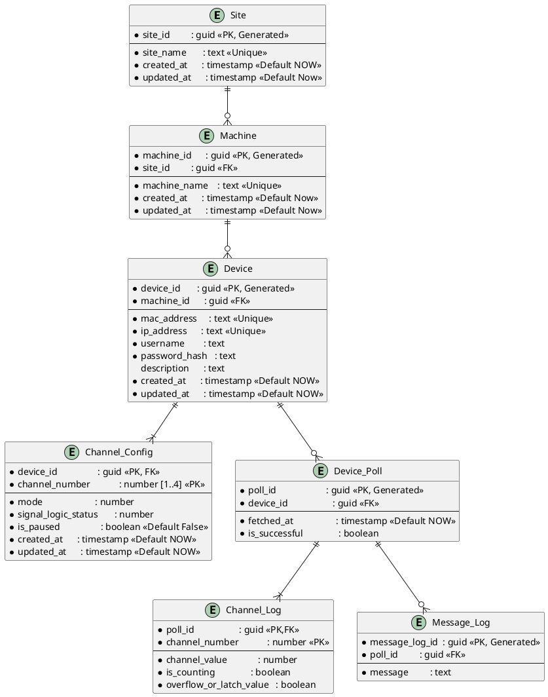

# KPI Database UML

```plantuml
@startuml

entity "Site" {
    *site_id         : guid <<PK, Generated>>
    --
    *site_name       : text <<Unique>>
    *created_at      : timestamp <<Default NOW>>
    *updated_at      : timestamp <<Default Now>>
}

entity "Machine" {
    *machine_id      : guid <<PK, Generated>>
    *site_id         : guid <<FK>>
    --
    *machine_name    : text <<Unique>>
    *created_at      : timestamp <<Default Now>>
    *updated_at      : timestamp <<Default Now>>
}

entity Device {
    *device_id       : guid <<PK, Generated>>
    *machine_id      : guid <<FK>>
    --
    *mac_address     : text <<Unique>>
    *ip_address      : text <<Unique>>
    *username        : text
    *password_hash   : text
    description      : text
    *created_at      : timestamp <<Default NOW>>
    *updated_at      : timestamp <<Default NOW>>
}

entity "Channel_Config" {
    *device_id                 : guid <<PK, FK>>
    *channel_number            : number [1..4] <<PK>>
    --
    *mode                      : number
    *signal_logic_status       : number
    *is_paused                 : boolean <<Default False>>
    *created_at      : timestamp <<Default NOW>>
    *updated_at      : timestamp <<Default NOW>>
}

entity "Device_Poll" {
  *poll_id                     : guid <<PK, Generated>>
  *device_id                   : guid <<FK>>
  --
  *fetched_at                  : timestamp <<Default NOW>>
  *is_successful               : boolean
}

entity "Channel_Log" {    
    *poll_id                   : guid <<PK,FK>>
    *channel_number            : number <<PK>>
    --
    *channel_value             : number
    *is_counting               : boolean
    *overflow_or_latch_value   : boolean
}

entity "Message_Log" {
    *message_log_id  : guid <<PK, Generated>>
    *poll_id         : guid <<FK>>
    --
    *message         : text
}

Site         ||--o{ Machine
Machine      ||--o{ Device
Device       ||--|{ Channel_Config
Device       ||--o{ Device_Poll
Device_Poll  ||--|{ Channel_Log
Device_Poll  ||--o{ Message_Log


@enduml
```
